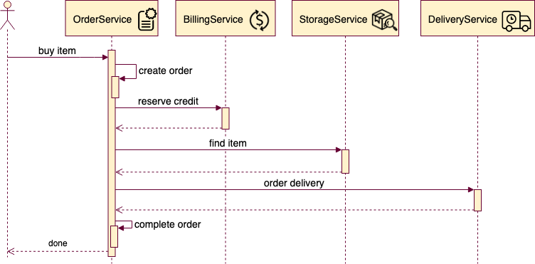
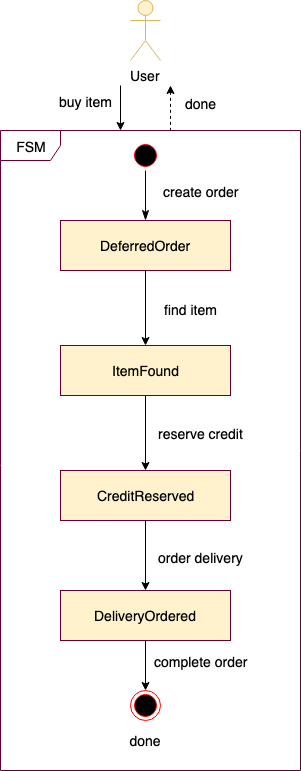

# "Buying item" saga example

## Sequence diagram of the transaction


## Diagram of the saga's states


## Implementation of the saga
```scala
type Step[A, B] = PersistedSaga[F, A, B, HNil, OrderId, Json]

val createOrder: Step[BuyItem, DeferredOrder] = PersistedSaga(
  (args: BuyItem) ⇒ orderService.createOrder(args.item).map(DeferredOrder(_, args.item)),
  (order: DeferredOrder, cause: Throwable) ⇒ orderService.markAsFailed(order.orderId, cause)
)(_.orderId)

val reserveCredit: Step[DeferredOrder, CreditReserved] = PersistedSaga(
  (order: DeferredOrder) ⇒
    billingService.reserveCredit(order.item.price).map(CreditReserved(order.orderId, _, order.item)),
  (credit: CreditReserved, _: Throwable) ⇒ billingService.returnCredit(credit.id)
)(_.orderId)

val findItem: Step[CreditReserved, ItemFound] = PersistedSaga(
  (credit: CreditReserved) ⇒ storeService.findItem(credit.item).map(ItemFound(credit.orderId, _, credit.item)),
  (item: ItemFound, _: Throwable) ⇒ storeService.revertItem(item.code)
)(_.orderId)

val orderDelivery: Step[ItemFound, DeliveryOrdered] = PersistedSaga(
  (item: ItemFound) ⇒ deliveryService.orderDelivery(item.item).map(DeliveryOrdered(item.orderId, _)),
  (deliveryOrder: DeliveryOrdered, _: Throwable) ⇒ deliveryService.cancelOrder(deliveryOrder.deliveryId)
)(_.orderId)

val completeOrder = Saga(
  (deliveryOrdered: DeliveryOrdered) ⇒
    orderService.markAsCompleted(deliveryOrdered.orderId).as(Done(deliveryOrdered.orderId))
)

createOrder andThen reserveCredit andThen findItem andThen orderDelivery completeOn completeOrder
```

More details here: [BuyingItemSaga.scala](src/main/scala/ru/dokwork/fasti/example/BuyingItemSaga.scala)